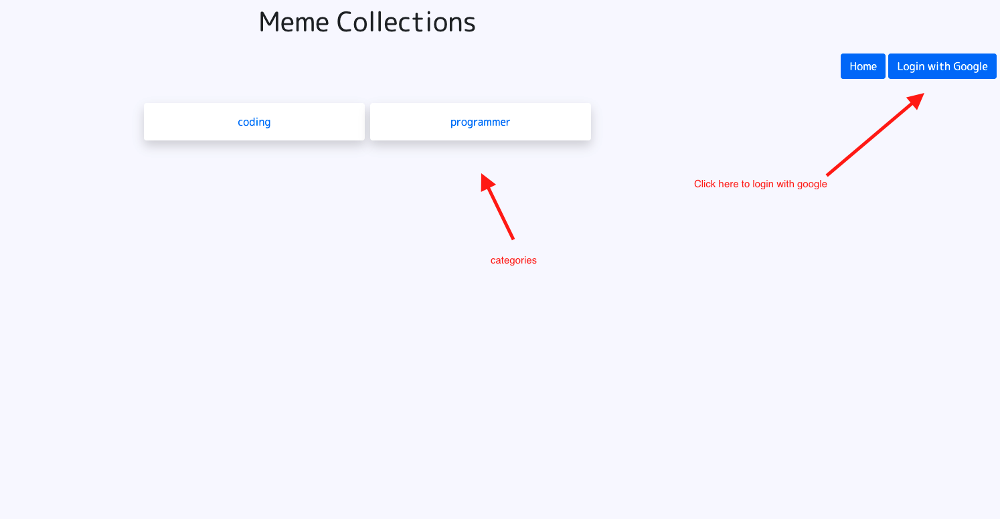
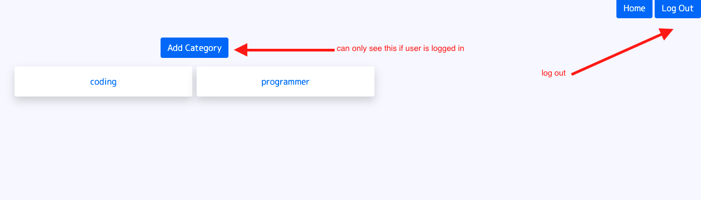
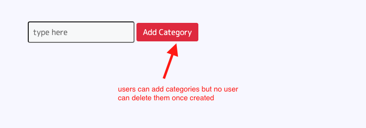
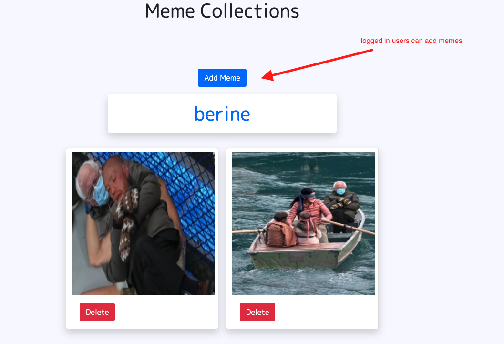
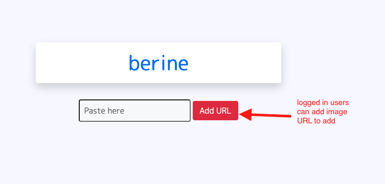
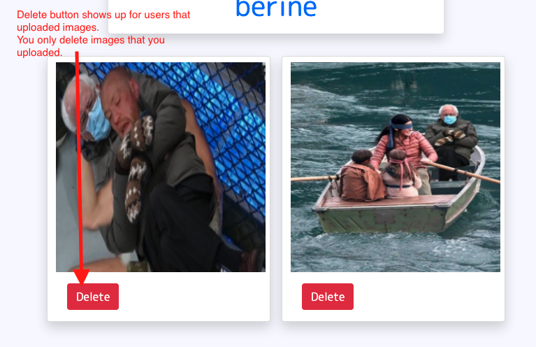
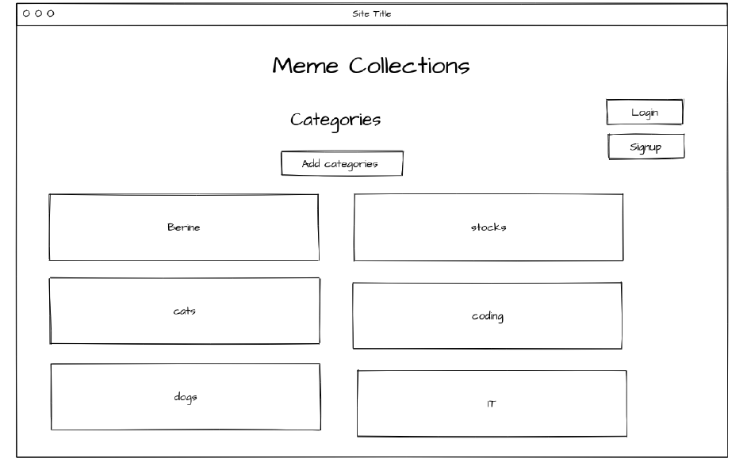
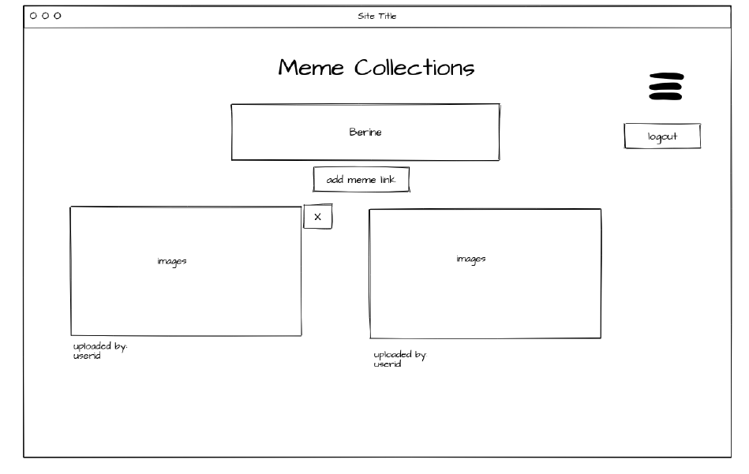
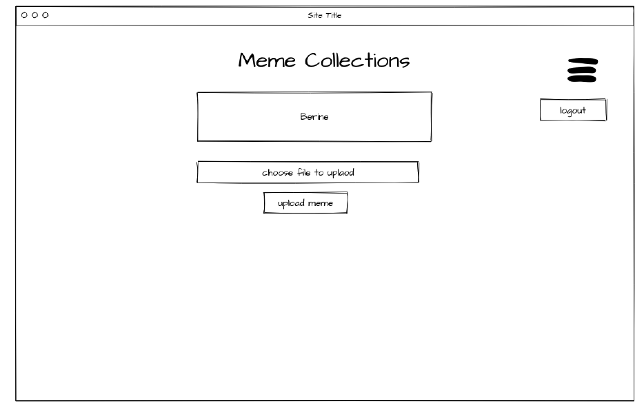

# meme-collections
info

## App Demo 
Link to app: https://serene-sea-32560.herokuapp.com/memes

## About Meme Collection: 
A place for meme collectors to come together to collect them all. This website allows users to create categories which people can can add memes based on those categories.   

## UI Screenshots: 
### Main page: 
 
### Add Categories: 
 
 

### Add Memes: 
 

### Delete: 
 

## Wireframes:

## Technologies Used:
    - HTML
    - CSS  
    - JavaScript
    - Node.js
    - Express
    - Passport
    - Google OAuth
    - Atlas Mongodb
    - Heroku
    - Ejs
    - Multer
     

## Approach: 
To create this app i used Trello to help me organize my work. I started with the wireframe and creating the relationships for this app. Then as I finished the tasks I updated my tasks. As I created each routes for my application I made sure the route was working and I could see the current view once the link was clicked. Once I saw that then I implanted my view and controller for that route. 

## Resources:
w3schools: https://www.w3schools.com/  
MDN Web Docs: https://developer.mozilla.org/en-US/docs/Web/JavaScript  
NPM: https://www.npmjs.com/
